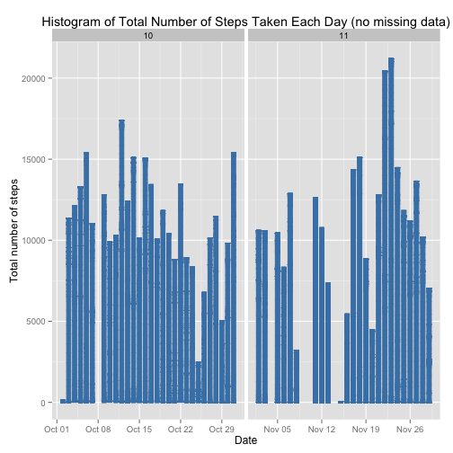

# Reproducible Research: Peer Assessment 1
==========================================
Created by Xiaodan Zhang on July 18, 2014

### Basic settings

```r
echo = TRUE  # Always make code visible
options(scipen = 1)  # Turn off scientific notations for numbers
```
### Loading and processing the data

```r
unzip("activity.zip")
data <- read.csv("activity.csv", colClasses = c("integer", "Date", "factor"))
attach(data)
```

```
## The following object is masked _by_ .GlobalEnv:
## 
##     steps
## The following object is masked from avgSteps (position 3):
## 
##     interval
## The following objects are masked from newData (position 4):
## 
##     date, interval, steps
## The following objects are masked from newData (position 5):
## 
##     date, interval, steps
## The following object is masked from avgSteps (position 6):
## 
##     interval
## The following objects are masked from noNA (position 7):
## 
##     date, interval, steps
## The following objects are masked from data (position 8):
## 
##     date, interval, steps
## The following object is masked from avgSteps (position 10):
## 
##     interval
## The following objects are masked from newData (position 11):
## 
##     date, interval, steps
## The following objects are masked from noNA (position 12):
## 
##     date, interval, steps
## The following objects are masked from noNA (position 13):
## 
##     date, interval, steps
## The following objects are masked from noNA (position 14):
## 
##     date, interval, steps
## The following objects are masked from newData (position 15):
## 
##     date, interval, steps
## The following objects are masked from noNA (position 16):
## 
##     date, interval, steps
## The following objects are masked from data (position 17):
## 
##     date, interval, steps
## The following object is masked from avgSteps (position 18):
## 
##     interval
## The following objects are masked from data (position 19):
## 
##     date, interval, steps
## The following objects are masked from data (position 20):
## 
##     date, interval, steps
## The following object is masked from avgSteps (position 21):
## 
##     interval
## The following objects are masked from data (position 22):
## 
##     date, interval, steps
## The following objects are masked from data (position 23):
## 
##     date, interval, steps
## The following objects are masked from noNA (position 25):
## 
##     date, interval, steps
## The following objects are masked from noNA (position 26):
## 
##     date, interval, steps
## The following objects are masked from dataWithoutNA (position 29):
## 
##     date, interval, steps
## The following objects are masked from dataWithoutNA (position 30):
## 
##     date, interval, steps
## The following objects are masked from dataWithoutNA (position 31):
## 
##     date, interval, steps
## The following objects are masked from dataWithoutNA (position 32):
## 
##     date, interval, steps
## The following objects are masked from dataWithoutNA (position 33):
## 
##     date, interval, steps
## The following objects are masked from data (position 35):
## 
##     date, interval, steps
```

```r
data$month <- as.numeric(format(date, "%m"))
noNA <- na.omit(data)
rownames(noNA) <- 1:nrow(noNA)
head(noNA)
```

```
##   steps       date interval month
## 1     0 2012-10-02        0    10
## 2     0 2012-10-02        5    10
## 3     0 2012-10-02       10    10
## 4     0 2012-10-02       15    10
## 5     0 2012-10-02       20    10
## 6     0 2012-10-02       25    10
```

```r
dim(noNA)
```

```
## [1] 15264     4
```

```r
library(ggplot2)
```

### What is mean total number of steps taken per day?
For this part of the assignment, you can ignore the missing values in the dataset.

1. Make a histogram of the total number of steps taken each day

```r
attach(noNA)
```

```
## The following object is masked _by_ .GlobalEnv:
## 
##     steps
## The following objects are masked from data (position 3):
## 
##     date, interval, steps
## The following object is masked from avgSteps (position 4):
## 
##     interval
## The following objects are masked from newData (position 5):
## 
##     date, interval, month, steps
## The following objects are masked from newData (position 6):
## 
##     date, interval, month, steps
## The following object is masked from avgSteps (position 7):
## 
##     interval
## The following objects are masked from noNA (position 8):
## 
##     date, interval, month, steps
## The following objects are masked from data (position 9):
## 
##     date, interval, steps
## The following object is masked from avgSteps (position 11):
## 
##     interval
## The following objects are masked from newData (position 12):
## 
##     date, interval, month, steps
## The following objects are masked from noNA (position 13):
## 
##     date, interval, month, steps
## The following objects are masked from noNA (position 14):
## 
##     date, interval, month, steps
## The following objects are masked from noNA (position 15):
## 
##     date, interval, month, steps
## The following objects are masked from newData (position 16):
## 
##     date, interval, month, steps
## The following objects are masked from noNA (position 17):
## 
##     date, interval, month, steps
## The following objects are masked from data (position 18):
## 
##     date, interval, steps
## The following object is masked from avgSteps (position 19):
## 
##     interval
## The following objects are masked from data (position 20):
## 
##     date, interval, steps
## The following objects are masked from data (position 21):
## 
##     date, interval, steps
## The following object is masked from avgSteps (position 22):
## 
##     interval
## The following objects are masked from data (position 23):
## 
##     date, interval, steps
## The following objects are masked from data (position 24):
## 
##     date, interval, steps
## The following objects are masked from noNA (position 26):
## 
##     date, interval, steps
## The following objects are masked from noNA (position 27):
## 
##     date, interval, month, steps
## The following objects are masked from dataWithoutNA (position 30):
## 
##     date, interval, month, steps
## The following objects are masked from dataWithoutNA (position 31):
## 
##     date, interval, month, steps
## The following objects are masked from dataWithoutNA (position 32):
## 
##     date, interval, steps
## The following objects are masked from dataWithoutNA (position 33):
## 
##     date, interval, steps
## The following objects are masked from dataWithoutNA (position 34):
## 
##     date, interval, steps
## The following objects are masked from data (position 36):
## 
##     date, interval, steps
```

```r
ggplot(noNA, aes(date, steps)) + geom_bar(stat = "identity", colour = "steelblue", fill = "steelblue", width = 0.7) + facet_grid(. ~ month, scales = "free") + labs(title = "Histogram of Total Number of Steps Taken Each Day", x = "Date", y = "Total number of steps")
```

 

2. Calculate and report the mean and median total number of steps taken per day

Mean total number of steps taken per day:

```r
totalSteps <- aggregate(steps, list(Date = date), FUN = "sum")$x
```

```
## Error: arguments must have same length
```

```r
mean(totalSteps)
```

```
## [1] 10766
```
Median total number of steps taken per day:

```r
median(totalSteps)
```

```
## [1] 10766
```

### What is the average daily activity pattern?
1. Make a time series plot (i.e. type = "l") of the 5-minute interval (x-axis) and the average number of steps taken, averaged across all days (y-axis)


```r
avgSteps <- aggregate(steps, list(interval = as.numeric(as.character(interval))), FUN = "mean")
```

```
## Error: arguments must have same length
```

```r
ggplot(avgSteps, aes(interval, y = x)) + geom_line(color = "steelblue", size = 0.8) + labs(title = "Time Series Plot of the 5-minute Interval", x = "5-minute intervals", y = "Average Number of Steps Taken")
```

```
## Error: Aesthetics must either be length one, or the same length as the
## dataProblems:x
```

2. Which 5-minute interval, on average across all the days in the dataset, contains the maximum number of steps?

```r
attach(avgSteps)
```

```
## The following object is masked from noNA (position 3):
## 
##     interval
## The following object is masked from data (position 4):
## 
##     interval
## The following objects are masked from avgSteps (position 5):
## 
##     interval, meanOfSteps, weekdays
## The following objects are masked from newData (position 6):
## 
##     interval, weekdays
## The following object is masked from newData (position 7):
## 
##     interval
## The following objects are masked from avgSteps (position 8):
## 
##     interval, meanOfSteps, weekdays
## The following object is masked from noNA (position 9):
## 
##     interval
## The following object is masked from data (position 10):
## 
##     interval
## The following objects are masked from avgSteps (position 12):
## 
##     interval, meanOfSteps, weekdays
## The following objects are masked from newData (position 13):
## 
##     interval, weekdays
## The following object is masked from noNA (position 14):
## 
##     interval
## The following object is masked from noNA (position 15):
## 
##     interval
## The following object is masked from noNA (position 16):
## 
##     interval
## The following object is masked from newData (position 17):
## 
##     interval
## The following object is masked from noNA (position 18):
## 
##     interval
## The following object is masked from data (position 19):
## 
##     interval
## The following object is masked from avgSteps (position 20):
## 
##     interval
## The following object is masked from data (position 21):
## 
##     interval
## The following object is masked from data (position 22):
## 
##     interval
## The following object is masked from avgSteps (position 23):
## 
##     interval
## The following object is masked from data (position 24):
## 
##     interval
## The following object is masked from data (position 25):
## 
##     interval
## The following object is masked from noNA (position 27):
## 
##     interval
## The following object is masked from noNA (position 28):
## 
##     interval
## The following object is masked from dataWithoutNA (position 31):
## 
##     interval
## The following object is masked from dataWithoutNA (position 32):
## 
##     interval
## The following object is masked from dataWithoutNA (position 33):
## 
##     interval
## The following object is masked from dataWithoutNA (position 34):
## 
##     interval
## The following object is masked from dataWithoutNA (position 35):
## 
##     interval
## The following object is masked from data (position 37):
## 
##     interval
```

```r
avgSteps[x == max(x), ]
```

```
##     interval weekdays meanOfSteps
## 104      835  weekday       230.4
## 392      835  weekend       138.1
```

### Imputing missing values
1. The total number of rows with NAs:


```r
sum(is.na(data))
```

```
## [1] 2304
```

2. Devise a strategy for filling in all of the missing values in the dataset. The strategy does not need to be sophisticated. For example, you could use the mean/median for that day, or the mean for that 5-minute interval, etc.

My strategy is to use the mean for that 5-minute interval to fill each NA value in the steps column.

3. Create a new dataset that is equal to the original dataset but with the missing data filled in.


```r
newData <- data 
for (i in 1:nrow(newData)) {
    if (is.na(newData$steps[i])) {
        newData$steps[i] <- avgSteps[which(newData$interval[i] == avgSteps$interval), ]$x
    }
}
```

```
## Error: replacement has length zero
```

```r
head(newData)
```

```
##   steps       date interval month
## 1    NA 2012-10-01        0    10
## 2    NA 2012-10-01        5    10
## 3    NA 2012-10-01       10    10
## 4    NA 2012-10-01       15    10
## 5    NA 2012-10-01       20    10
## 6    NA 2012-10-01       25    10
```

```r
sum(is.na(newData))
```

```
## [1] 2304
```

4. Make a histogram of the total number of steps taken each day and Calculate and report the mean and median total number of steps taken per day. 


```r
ggplot(newData, aes(date, steps)) + geom_bar(stat = "identity", colour = "steelblue", fill = "steelblue", width = 0.7) + facet_grid(. ~ month, scales = "free") + labs(title = "Histogram of Total Number of Steps Taken Each Day (no missing data)", x = "Date", y = "Total number of steps")
```

```
## Warning: Removed 576 rows containing missing values (position_stack).
## Warning: Removed 1728 rows containing missing values (position_stack).
```

 

Do these values differ from the estimates from the first part of the assignment? What is the impact of imputing missing data on the estimates of the total daily number of steps?

Mean total number of steps taken per day:

```r
attach(newData)
```

```
## The following object is masked _by_ .GlobalEnv:
## 
##     steps
## The following object is masked from avgSteps (position 3):
## 
##     interval
## The following objects are masked from noNA (position 4):
## 
##     date, interval, month, steps
## The following objects are masked from data (position 5):
## 
##     date, interval, steps
## The following object is masked from avgSteps (position 6):
## 
##     interval
## The following objects are masked from newData (position 7):
## 
##     date, interval, month, steps
## The following objects are masked from newData (position 8):
## 
##     date, interval, month, steps
## The following object is masked from avgSteps (position 9):
## 
##     interval
## The following objects are masked from noNA (position 10):
## 
##     date, interval, month, steps
## The following objects are masked from data (position 11):
## 
##     date, interval, steps
## The following object is masked from avgSteps (position 13):
## 
##     interval
## The following objects are masked from newData (position 14):
## 
##     date, interval, month, steps
## The following objects are masked from noNA (position 15):
## 
##     date, interval, month, steps
## The following objects are masked from noNA (position 16):
## 
##     date, interval, month, steps
## The following objects are masked from noNA (position 17):
## 
##     date, interval, month, steps
## The following objects are masked from newData (position 18):
## 
##     date, interval, month, steps
## The following objects are masked from noNA (position 19):
## 
##     date, interval, month, steps
## The following objects are masked from data (position 20):
## 
##     date, interval, steps
## The following object is masked from avgSteps (position 21):
## 
##     interval
## The following objects are masked from data (position 22):
## 
##     date, interval, steps
## The following objects are masked from data (position 23):
## 
##     date, interval, steps
## The following object is masked from avgSteps (position 24):
## 
##     interval
## The following objects are masked from data (position 25):
## 
##     date, interval, steps
## The following objects are masked from data (position 26):
## 
##     date, interval, steps
## The following objects are masked from noNA (position 28):
## 
##     date, interval, steps
## The following objects are masked from noNA (position 29):
## 
##     date, interval, month, steps
## The following objects are masked from dataWithoutNA (position 32):
## 
##     date, interval, month, steps
## The following objects are masked from dataWithoutNA (position 33):
## 
##     date, interval, month, steps
## The following objects are masked from dataWithoutNA (position 34):
## 
##     date, interval, steps
## The following objects are masked from dataWithoutNA (position 35):
## 
##     date, interval, steps
## The following objects are masked from dataWithoutNA (position 36):
## 
##     date, interval, steps
## The following objects are masked from data (position 38):
## 
##     date, interval, steps
```

```r
newTotalSteps <- aggregate(steps, list(Date = date), FUN = "sum")$x
newMean <- mean(newTotalSteps)
newMean
```

```
## [1] 10766
```
Median total number of steps taken per day:

```r
newMedian <- median(newTotalSteps)
newMedian
```

```
## [1] 10766
```
Compare them with the two before imputing missing data:

```r
oldMean <- mean(totalSteps)
oldMedian <- median(totalSteps)
newMean - oldMean
```

```
## [1] 0
```

```r
newMedian - oldMedian
```

```
## [1] 0
```
So, after imputing the missing data, the new mean of total steps taken per day is the same as that of the old mean; the new median of total steps taken per day is greater than that of the old median.

### Are there differences in activity patterns between weekdays and weekends?

1. Create a new factor variable in the dataset with two levels -- "weekday" and "weekend" indicating whether a given date is a weekday or weekend day.


```r
head(newData)
```

```
##   steps       date interval month
## 1    NA 2012-10-01        0    10
## 2    NA 2012-10-01        5    10
## 3    NA 2012-10-01       10    10
## 4    NA 2012-10-01       15    10
## 5    NA 2012-10-01       20    10
## 6    NA 2012-10-01       25    10
```

```r
newData$weekdays <- factor(format(newData$date, "%A"))
levels(newData$weekdays)
```

```
## [1] "Friday"    "Monday"    "Saturday"  "Sunday"    "Thursday"  "Tuesday"  
## [7] "Wednesday"
```

```r
levels(newData$weekdays) <- list(weekday = c("Monday", "Tuesday", "Wednesday", "Thursday", "Friday"), weekend = c("Saturday", "Sunday"))
levels(newData$weekdays)
```

```
## [1] "weekday" "weekend"
```

```r
table(newData$weekdays)
```

```
## 
## weekday weekend 
##   12960    4608
```

2. Make a panel plot containing a time series plot (i.e. type = "l") of the 5-minute interval (x-axis) and the average number of steps taken, averaged across all weekday days or weekend days (y-axis).


```r
attach(newData)
```

```
## The following object is masked _by_ .GlobalEnv:
## 
##     steps
## The following objects are masked from newData (position 3):
## 
##     date, interval, month, steps
## The following objects are masked from avgSteps (position 4):
## 
##     interval, weekdays
## The following objects are masked from noNA (position 5):
## 
##     date, interval, month, steps
## The following objects are masked from data (position 6):
## 
##     date, interval, steps
## The following objects are masked from avgSteps (position 7):
## 
##     interval, weekdays
## The following objects are masked from newData (position 8):
## 
##     date, interval, month, steps, weekdays
## The following objects are masked from newData (position 9):
## 
##     date, interval, month, steps
## The following objects are masked from avgSteps (position 10):
## 
##     interval, weekdays
## The following objects are masked from noNA (position 11):
## 
##     date, interval, month, steps
## The following objects are masked from data (position 12):
## 
##     date, interval, steps
## The following objects are masked from avgSteps (position 14):
## 
##     interval, weekdays
## The following objects are masked from newData (position 15):
## 
##     date, interval, month, steps, weekdays
## The following objects are masked from noNA (position 16):
## 
##     date, interval, month, steps
## The following objects are masked from noNA (position 17):
## 
##     date, interval, month, steps
## The following objects are masked from noNA (position 18):
## 
##     date, interval, month, steps
## The following objects are masked from newData (position 19):
## 
##     date, interval, month, steps
## The following objects are masked from noNA (position 20):
## 
##     date, interval, month, steps
## The following objects are masked from data (position 21):
## 
##     date, interval, steps
## The following object is masked from avgSteps (position 22):
## 
##     interval
## The following objects are masked from data (position 23):
## 
##     date, interval, steps
## The following objects are masked from data (position 24):
## 
##     date, interval, steps
## The following object is masked from avgSteps (position 25):
## 
##     interval
## The following objects are masked from data (position 26):
## 
##     date, interval, steps
## The following objects are masked from data (position 27):
## 
##     date, interval, steps
## The following objects are masked from noNA (position 29):
## 
##     date, interval, steps
## The following objects are masked from noNA (position 30):
## 
##     date, interval, month, steps
## The following objects are masked from dataWithoutNA (position 33):
## 
##     date, interval, month, steps
## The following objects are masked from dataWithoutNA (position 34):
## 
##     date, interval, month, steps
## The following objects are masked from dataWithoutNA (position 35):
## 
##     date, interval, steps
## The following objects are masked from dataWithoutNA (position 36):
## 
##     date, interval, steps
## The following objects are masked from dataWithoutNA (position 37):
## 
##     date, interval, steps
## The following objects are masked from data (position 39):
## 
##     date, interval, steps
```

```r
avgSteps <- aggregate(steps, list(interval = as.numeric(as.character(interval)), weekdays = weekdays), FUN = "mean")
names(avgSteps)[3] <- "meanOfSteps"
attach(avgSteps)
```

```
## The following objects are masked from newData (position 3):
## 
##     interval, weekdays
## The following object is masked from newData (position 4):
## 
##     interval
## The following objects are masked from avgSteps (position 5):
## 
##     interval, meanOfSteps, weekdays
## The following object is masked from noNA (position 6):
## 
##     interval
## The following object is masked from data (position 7):
## 
##     interval
## The following objects are masked from avgSteps (position 8):
## 
##     interval, meanOfSteps, weekdays
## The following objects are masked from newData (position 9):
## 
##     interval, weekdays
## The following object is masked from newData (position 10):
## 
##     interval
## The following objects are masked from avgSteps (position 11):
## 
##     interval, meanOfSteps, weekdays
## The following object is masked from noNA (position 12):
## 
##     interval
## The following object is masked from data (position 13):
## 
##     interval
## The following objects are masked from avgSteps (position 15):
## 
##     interval, meanOfSteps, weekdays
## The following objects are masked from newData (position 16):
## 
##     interval, weekdays
## The following object is masked from noNA (position 17):
## 
##     interval
## The following object is masked from noNA (position 18):
## 
##     interval
## The following object is masked from noNA (position 19):
## 
##     interval
## The following object is masked from newData (position 20):
## 
##     interval
## The following object is masked from noNA (position 21):
## 
##     interval
## The following object is masked from data (position 22):
## 
##     interval
## The following object is masked from avgSteps (position 23):
## 
##     interval
## The following object is masked from data (position 24):
## 
##     interval
## The following object is masked from data (position 25):
## 
##     interval
## The following object is masked from avgSteps (position 26):
## 
##     interval
## The following object is masked from data (position 27):
## 
##     interval
## The following object is masked from data (position 28):
## 
##     interval
## The following object is masked from noNA (position 30):
## 
##     interval
## The following object is masked from noNA (position 31):
## 
##     interval
## The following object is masked from dataWithoutNA (position 34):
## 
##     interval
## The following object is masked from dataWithoutNA (position 35):
## 
##     interval
## The following object is masked from dataWithoutNA (position 36):
## 
##     interval
## The following object is masked from dataWithoutNA (position 37):
## 
##     interval
## The following object is masked from dataWithoutNA (position 38):
## 
##     interval
## The following object is masked from data (position 40):
## 
##     interval
```

```r
library(lattice)
xyplot(meanOfSteps ~ interval | weekdays, layout = c(1, 2), type = "l", xlab = "Interval", ylab = "Number of steps")
```

 
